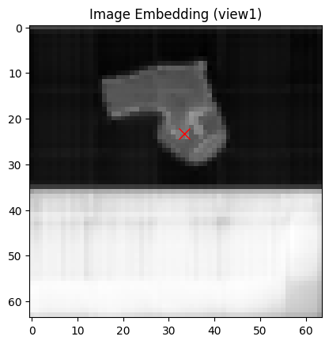
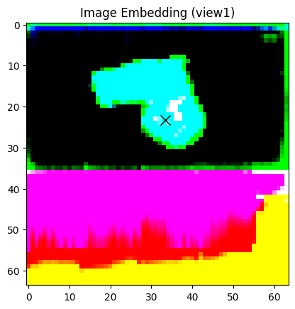
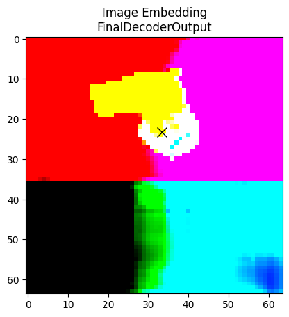

# SAM Feature Visualization

## Single Point as the prompt

Refer to this [notebook](https://github.com/keyanzhai/SAM-feature-visualization/blob/main/single-point-prompt/single-prompt-features.ipynb).

## A grid of points as the prompt

Refer to this [notebook](https://github.com/keyanzhai/SAM-feature-visualization/blob/main/grid-points-prompt/grid-prompt-features.ipynb).

## Example

E.g. A synthetic hand + cup image with the prompt point at the hand's thumb.

### Original image

### Initial Image Embedding (256-d reduced with PCA)

### Image Embedding after the first decoder block

### Image Embedding after the second decoder block

### Upscaled Image Embedding

### Low Resolution Masks

### Original Resolution Masks

### Binarized Masks

### Masked RGBA Images

